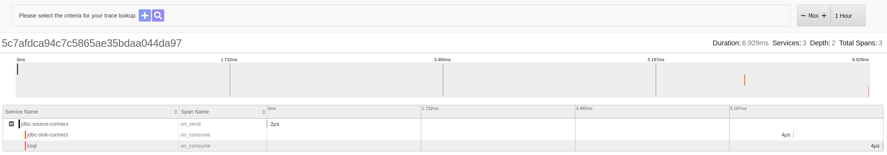

# Kafka Interceptor: Zipkin

[](https://www.travis-ci.org/sysco-middleware/kafka-interceptor-zipkin)

Kafka [Consumer](https://kafka.apache.org/0100/javadoc/org/apache/kafka/clients/consumer/ConsumerInterceptor.html)
and 
[Producer](https://kafka.apache.org/0100/javadoc/org/apache/kafka/clients/producer/ProducerInterceptor.html) 
Interceptor to record tracing data.

This interceptors could be added to Kafka Connectors via configuration and to other off-the-shelf 
components like Kafka REST Proxy, KSQL and so on.

## Installation

### Producer Interceptor

Producer Interceptor create spans on sending records. This span will only represent the time it took to 
execute the `on_send` method provided by the API, not how long to send the actual record, or any other latency.

#### Kafka Clients

Add Interceptor to Producer Configuration:

```java
    producerConfig.put(ProducerConfig.INTERCEPTOR_CLASSES_CONFIG, Collections.singletonList(TracingProducerInterceptor.class));
```
### Consumer Interceptor

Consumer Interceptor create spans on consumption of records. This span will only represent the time it took execute
the `on_consume` method provided by the API, not how long it took to commit, or any other latency. 

#### Kafka Clients

```java
    consumerConfig.put(ConsumerConfig.INTERCEPTOR_CLASSES_CONFIG, Collections.singletonList(TracingConsumerInterceptor.class));
```

### Configuration

| Key                           | Value                                                                                 |
|-------------------------------|---------------------------------------------------------------------------------------|
| `zipkin.sender.type`          | Sender type: `NONE`(default), `KAFKA`, `HTTP` |
| `zipkin.encoding` | Zipkin encoding: `JSON`(default), `PROTO3`. |
| `zipkin.http.endpoint`        | Zipkin HTTP Endpoint sender. |
| `zipkin.kafka.bootstrap.servers`    | Bootstrap Servers list to send Spans. if not present, `bootstrap.servers` (Kafka Client property) is used. |
| `zipkin.local.service.name`   | Application Service name used to tag span. Default: kafka-client. |
| `zipkin.trace.id.128bit.enabled` | Trace ID 128 bit enabled, default: `true` |
| `zipkin.sampler.rate`         | Rate to sample spans. Default: `1.0`                                                  |

### How to test it

Start Docker Compose [docker-compose.yml](docker-compose.yml)

```bash
docker-compose up -d
```

And to test how it works with Kafka Connectors and KSQL, other composes can be started:

```bash
docker-compose -f docker-compose.yml -f docker-compose-ksql.yml -f docker-compose-connectors.yml up -d
```

Steps to test:
1. Navigate to http://localhost:18080 and login using __postgres__ as server, __postgres__ as username and __example__ as password

2. Create a table "source_table" with an auto-increment __id__ and __name__ field

3. Once table is created deploy source and sink connectors using Makefile: 

```bash
make source-connector
make sink-connector
```

3. Insert values to the table and check the traces.

4. Create a Stream in KSQL:

```bash
ksql http://localhost:8088
 CREATE STREAM source_stream (id BIGINT, name VARCHAR) WITH (KAFKA_TOPIC='jdbc_source_table', VALUE_FORMAT='JSON');
```

5. Check traces:


