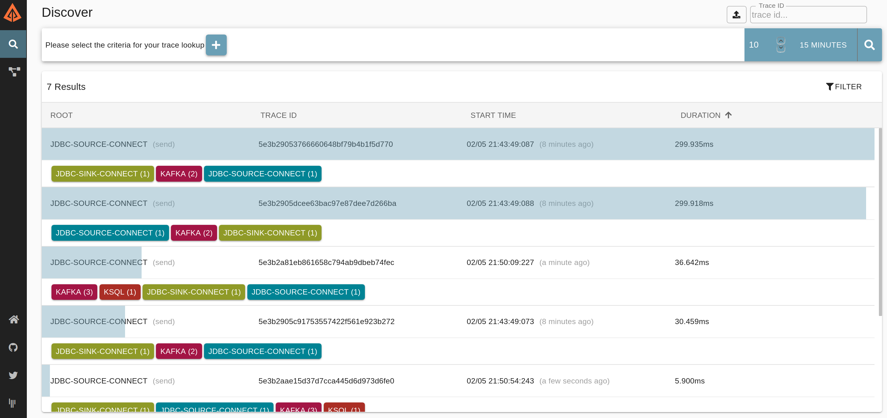

# Brave: Kafka Interceptor

[](https://gitter.im/openzipkin/zipkin)
[](https://github.com/openzipkin-contrib/brave-kafka-interceptor/actions?query=workflow%3Atest)
[](https://search.maven.org/search?q=g:io.zipkin.contrib.brave-kafka-interceptor%20AND%20a:brave-kafka-interceptor)

Kafka [Consumer](https://kafka.apache.org/0100/javadoc/org/apache/kafka/clients/consumer/ConsumerInterceptor.html)
and [Producer](https://kafka.apache.org/0100/javadoc/org/apache/kafka/clients/producer/ProducerInterceptor.html)
Interceptors for tracing and report to Zipkin.

These interceptors could be plugged into Kafka applications via classpath configuration.

The purpose of this instrumentation is to enable tracing for Kafka Connect and other off-the-shelf components like Kafka REST Proxy, ksqlDB, etc.
For more complete tracing support, check [Brave instrumentation](https://github.com/openzipkin/brave) for [Kafka Clients](https://github.com/openzipkin/brave/tree/master/instrumentation/kafka-clients) and [Kafka Streams](https://github.com/openzipkin/brave/tree/master/instrumentation/kafka-streams).

## Installation

### Producer Interceptor

Producer Interceptor create spans when sending records. This span will only represent the time it took to
execute the `on_send` method provided by the API, not how long to send the actual record, or any other latency.

#### Kafka Clients

Add Interceptor to Producer Configuration:

```java
    producerConfig.put(ProducerConfig.INTERCEPTOR_CLASSES_CONFIG, Collections.singletonList(TracingProducerInterceptor.class));
    //or
    producerConfig.put("interceptor.classes", "brave.kafka.interceptor.TracingProducerInterceptor");
```
### Consumer Interceptor

Consumer Interceptor create spans on consumption of records. This span will only represent the time it took execute
the `on_consume` method provided by the API, not how long it took to commit, or any other latency.

#### Kafka Clients

```java
    consumerConfig.put(ConsumerConfig.INTERCEPTOR_CLASSES_CONFIG, Collections.singletonList(TracingConsumerInterceptor.class));
    //or
    consumerConfig.put("interceptor.classes", "brave.kafka.interceptor.TracingConsumerInterceptor");
```

### Configuration

| Key                              | Value                                                                                                   |
|----------------------------------|---------------------------------------------------------------------------------------------------------|
| `zipkin.sender.type`             | Sender type: `NONE`(default), `KAFKA`, `HTTP`                                                           |
| `zipkin.encoding`                | Zipkin encoding: `JSON`(default), `PROTO3`.                                                             |
| `zipkin.http.endpoint`           | Zipkin HTTP Endpoint sender.                                                                            |
| `zipkin.kafka.bootstrap.servers` | Bootstrap Servers list to send Spans. if not present, `bootstrap.servers` (Kafka Client property) is used. |
| `zipkin.local.service.name`      | Application Service name used to tag span. Default: kafka-client.                                       |
| `zipkin.trace.id.128bit.enabled` | Trace ID 128 bit enabled, default: `true`                                                               |
| `zipkin.sampler.rate`            | Rate to sample spans. Default: `1.0`                                                                    |
| `zipkin.kafka.*`                 | Use this prefix to override any kafka producer property                                                 |

### How to test it

Required software available:

- Docker and Docker Compose available.
- JDK 11+

Start by building libraries and run Docker Compose:

```shell script
make docker-up # will build jars and start containers
# or
./mvnw clean package
docker-compose up -d
```

Create database tables:

```shell script
make pg-table
```

Once table is created deploy source and sink connectors:

```shell script
make kafka-connectors
```

Create a KSQL table and select to wait for results:

```shell script
make ksql-stream
make ksql-select
```

Insert new rows:

```shell script
make pg-row
```

Go to <http://localhost:9411> Check the traces.


Traces should look like this:

Search:



Trace view:


Dependencies:


## Artifacts
All artifacts publish to the group ID "io.zipkin.contrib.brave-kafka-interceptor". We use a common
release version for all components.

### Library Releases
Releases are at [Sonatype](https://oss.sonatype.org/content/repositories/releases) and [Maven Central](http://search.maven.org/#search%7Cga%7C1%7Cg%3A%22io.zipkin.contrib.brave-kafka-interceptor%22)

### Library Snapshots
Snapshots are uploaded to [Sonatype](https://oss.sonatype.org/content/repositories/snapshots) after
commits to master.
